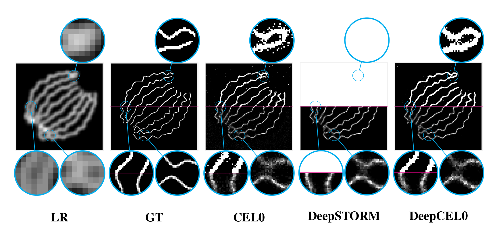
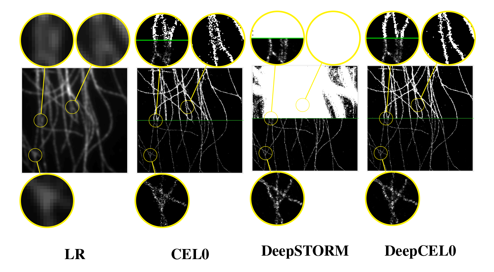

# DeepCEL0 for 2D Single Molecule Localization in Fluorescence Microscopy

## Abstract
In fluorescence microscopy,  Single Molecule Localization Microscopy (SMLM) techniques aim at localizing with high precision high density fluorescent molecules by stochastically activating and imaging small subsets of blinking emitters.  Super Resolution (SR) plays an important role in this field since it allows to go beyond the intrinsic light diffraction limit.

In  this  work,  we  propose  a  deep  learning-based  algorithm  for  precise  molecule  localization of high density frames acquired by SMLM techniques whose L2-based loss function is regularized by positivity and L0-based constraints. The L0 is relaxed through its Continuous Exact L0 (CEL0) counterpart.The  arising  approach,  named  DeepCEL0,  is  parameter-free,  more  flexible,  faster  and  provides  more precise molecule localization maps if compared to the other state-of-the-art methods.  We validate our approach on both simulated and real fluorescence microscopy data.

---

##  Localization on IEEE ISBI simulated dataset

## Localization on IEEE ISBI real dataset

---

## Credits
he code of this paper is built upon the [ZeroCostDL4Mic](https://github.com/HenriquesLab/ZeroCostDL4Mic) and [Deep-STORM](https://github.com/EliasNehme/Deep-STORM) repositories.

